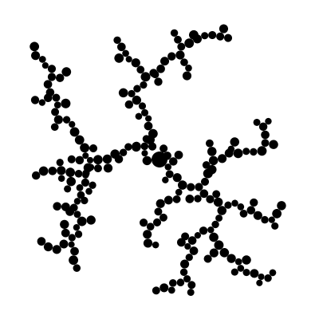
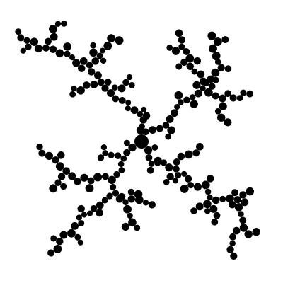
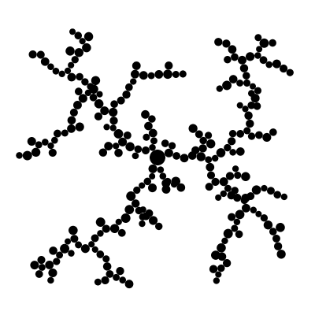
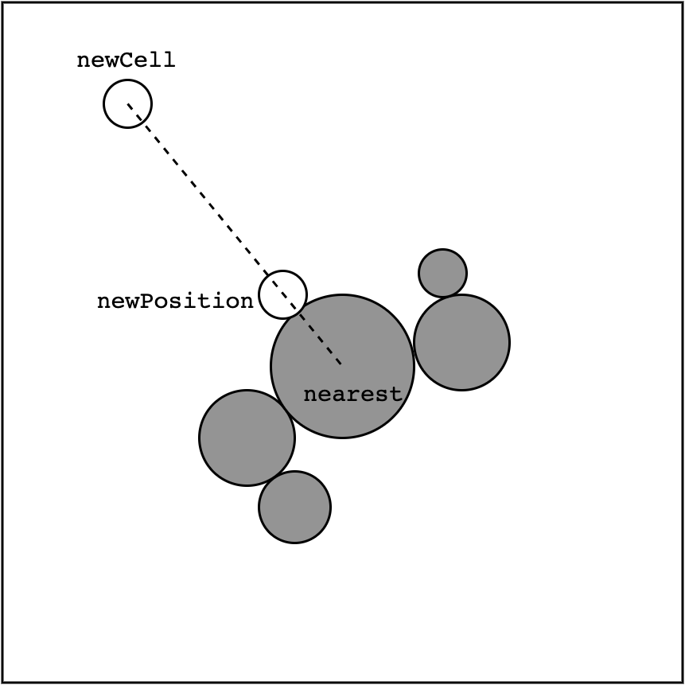
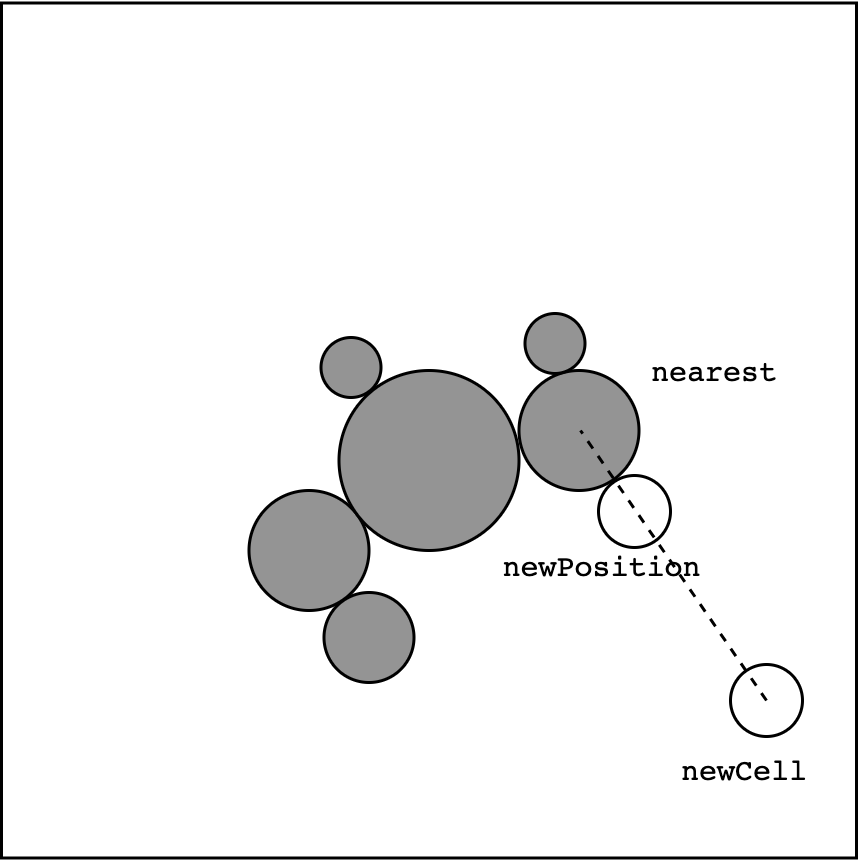

# Proyecto A. Crecimiento Coral (DLA) con Vectores

### Objetivo

En este proyecto pondras a prueba tus habilidades de manejo de operaciones de vectores, programando una dinamica de crecimiento coral. Este programa debe tener la capacidad de producir imagenes como las siguientes:




<br clear="both"/>

### Descripción

Nuestro coral esta hecho de pequeños elementos a los que llamaremos **celulas**. Cada celula tiene una **posicion** y un **radio**.
A las celulas que constituyen el coral las guardamos en una lista. Al inicio, la lista comienza con una sola celula en el centro del canvas, y despues se van agregando las ceulas una por una, de forma que vaya creciendo a lo largo del programa.

El algoritmo a implementar que crea fractales coralinos, es el siguiente:
1. Incia la lista que represental al fractal con una celula.
2. Para agregar una nueva celula:
   1. Crea una celula, llamada `newCell` con posicion y radio aleatorios.
   2. Obten la celula mas cercana de todas las que ya estan en el coral (es decir, las que estan guardadas en la lista). Llamemosle `nearest`.
   3. Calcula una nueva posicion para la celula `newCell`, de tal forma que esté al lado de la celula `nearest` en la misma dirección que esta `newCell`. Por ejemplo, en las siguientes imagenes se muestran como se agregan dos nuevas celulas.
   
   <br clear="both"/>
   
   
   <br clear="both"/>
   
### Detalles de implementación

En el sketch `FractalGrow` incluido en este repositorio se encuentra el codigo base para tu proyecto. Que a continuacion describiremos.

En la clase `Cell` se encuentra una representacion de cada **celula** del coral. Guarda dos propiedades `position` y `radius`; asi como los metodos `render`, `distanceTo` y el constructor.

Al coral lo estamos representando con un `ArrayList` para ir agregando dinamicamente a las celulas. Esta declarado al incio del archivo principal e inicializado en el `setup`:

```processing
ArrayList<Cell> cells;

void setup () {
  size(700, 700);
  smooth();

  cells = new ArrayList<Cell>();

  Cell centerCell = new Cell(width / 2.0, height / 2.0, 10); 
  cells.add(centerCell);
}

```

Note ademas que tambien se agrega la primer celula (del centro).

El metodo `draw` se ve de la siguiente forma:

```processing
void draw () {
  background(255);

  addNewCell();
  renderCells();
}
```

El metodo `renderCells()` no tiene mucho chiste pues lo unico que hace es dibujar todas las celulas invocando el metodo `render()` de cada una de ellas.
Asi que como te puedes dar cuenta, la magia ocurre en el metodo `addNewCell()`. Aqui es donde debe ocurrir los pasos del algoritmo anteriormente explicado. Este es el metodo que tienes que terminar de programar para completar este proyecto.

### ¿Qué debo programar?

Crear una nueva celula con posicion y radio aleatorio es trivial, esto ya esta hecho.

Para hallar a la celula mas cercana, les programe el metodo `Cell getNearestCell(Cell aCell) { ... }`, que itera a las celulas de la lista y manda a llamar el metodo `distanceTo` de cada celula. Este metodo se ve:

```processing
float distanceTo(Cell anotherCell) {
  return 0.0;
}
```

Como te puedes dar cuenta no esta terminado pues solo regresa `0`. Debes entonces, terminar de programar este metodo.

Una vez hecho esto, debes calcular la nueva posicion para la nueva celula antes de ser agregada a la lista:

```processing
  PVector newPosition;
  newCell.position = newPosition;
  
  cells.add(newCell);
```

Si corres el programa saldra un `NullPointerException`, puesto que no esta inicializada el objeto `newPosition`.

### ¿Qué debo entregar?

Sube tu _sketch_ funcionando con la dinamica requerida, asi como distintas exploraciones visuales modificando la forma de las celulas. Usa el metodo `saveFrame` para exportar los cuadros que te parezcan interesantes.

No olvides que cualquier posible duda que tengas puedes crear un issue en este repositorio.

Happy Hacking! :D
